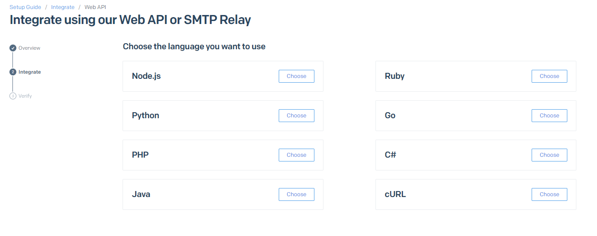

**Читать на других языках: [Русский](README.md), [Українська](README.ua.md).**

# Домашнє завдання 6

Створи гілку `hw06-email` з гілки` master`.

Продовжуємо створення REST API для роботи з колекцією контактів. Додайте верифікацію email користувача після реєстрації за допомогою сервісу [SendGrid](https://sendgrid.com/).

## Як процес верифікації повинен працювати

1. Після реєстрації, користувач повинен отримати лист на вказану при реєстрації пошту з посиланням для верифікації свого email
2. Пройшовши посиланням в отриманому листі, в перший раз, користувач повинен отримати [Відповідь зі статусом 200](#verification-success-response), що буде мати на увазі успішну верифікацію email
3. Пройшовши по посиланню повторно користувач повинен отримати [Помилку зі статусом 404](#verification-user-not-found)

## Крок 1

### Підготовка інтеграції з SendGrid API

- Зареєструйся на [SendGrid](https://sendgrid.com/).
- Створи email-відправника. Для це в адміністративній панелі SendGrid зайдіть в меню Marketing в підміню senders і в правому верхньому куті натисніть кнопку "Create New Sender". Заповніть поля в запропонованій формі. Збережіть. Повинен вийде наступний як на картинці результат, тільки з вашим email:


На вказаний email повинно прийти лист верифікації (перевірте спам якщо не бачите листи). Натисніть на посилання в ньому і завершите процес. Результат повинен зміниться на:


- Тепер необхідно створити API токен доступу. Вибираємо меню "Email API", і підміню "Integration Guide". Тут вибираємо "Web API"


Далі необхідно вибрати технологію Node.js



На третьому кроці даємо ім'я нашого токені. Наприклад systemcats, натискаємо кнопку згенерувати і отримуємо результат як на скріншоті нижче. Необхідно скопіювати цей токен (це важливо, тому що більше ви не зможете його подивитися). Після завершити процес створення токена


- Отриманий API-токен треба додати в `.env` файл в нашому проекті

## Крок 2

### Створення ендпоінта для верифікації email

- додати в модель `User` два поля `verificationToken` і `verify`. Значення поля `verify` рівне `false` означатиме, що його email ще не пройшов верифікацію

```js
{
  verify: {
    type: Boolean,
    default: false,
  },
  verifyToken: {
    type: String,
    required: [true, 'Verify token is required'],
  },
}
```

- створити ендпоінт GET [`/users/verify/:verificationToken`](# verification-request), де по параметру `verificationToken` ми будемо шукати користувача в моделі `User`
- якщо користувач з таким токеном не знайдений, необхідно повернути [Помилку 'Not Found'](#verification-user-not-found)
- якщо користувач знайдений - встановлюємо `verificationToken` в `null`, а поле `verify` ставимо рівним` true` в документі користувача і повертаємо [Успішний відповідь](#verification-success-response)

### Verification request

```shell
GET /auth/verify/:verificationToken
```

### Verification user Not Found

```shell
Status: 404 Not Found
ResponseBody: {
  message: 'User not found'
}
```

### Verification success response

```shell
Status: 200 OK
ResponseBody: {
  message: 'Verification successful',
}
```

## Крок 3

### Додавання відправки email'а користувачеві з посиланням для верифікації

Після створення користувача при реєстрації:

- створити `verificationToken` для зареєстрованого користувача і записати його в БД (для генерації токена використовуйте [uuid](https://www.npmjs.com/package/uuid))
- відправити email на пошту користувача і вказати посилання для верифікації email'а (`/auth/verify/:verificationToken`) в [html повідомлення](https://app.gitbook.com/@reloaderlev/s/goit-node-js-new-program/email-rozsilka/sendgrid.-vidpravka-email-iv-cherez-paket-sendgrid-mail)

## Крок 4

### Перевірка правильності роботи

[Умови, зазначені на початку завдання](#як-має-працювати-в-кінцевому-результаті), повинні працювати
